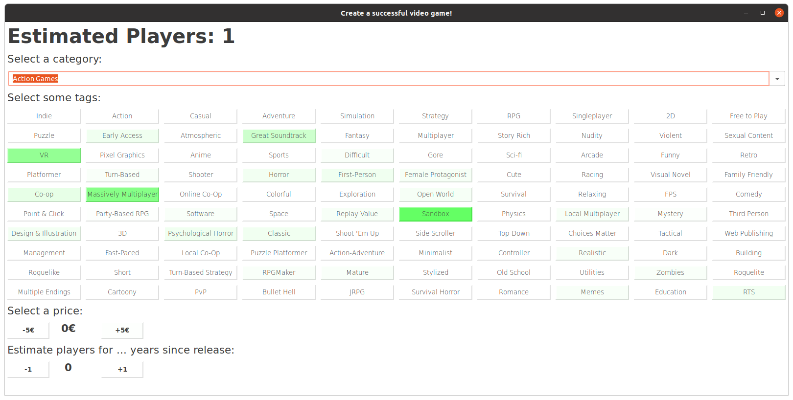

# How to make a popular video game

## How to run the application

### Setup the environment

We assume that conda is installed. First create a new environment:

`conda create --name popgame`

Activate the environment:

`conda activate popgame`

Ensure that no packages are installed:

`conda list`

Install the correct python version:

`conda install python=3.7.9`

Install the following packages:

`conda install joblib=0.17.0`

`conda install numpy=1.19.1`

`conda install wxpython=4.0.4`

`conda install scikit-learn=0.23.2`

### Run the app

Go to the directory where `app.py` is located (i.e. the directory where this Readme is located as well).

Run the app with python:

`python app.py`

If the wrong python is used for some reason, try something like:

`~/anaconda3/envs/popgame/bin/python app.py`

The result should look like that:

There might be some visual differences depending on your OS. This screenshot was taken under Ubuntu 20.04.1 LTS.

If you observe that the button colors do not change (except for the one button pressed), try running the app as follows:

`python app.py -f`

This forces a color change for each button.

### How to use the app

Select a category from the drop down menu. Select tags by clicking the according buttons.
Activated tags are marked in bold letters. Increase or decrease the price in steps of 5€ with the
according buttons. Increase or decrease the number of years after release with the according buttons.

Observe how the estimated number of players (textfield at the top) changes when you change features.

The coloring of buttons, respectively the colored squares next to each entry in the category menu, indicate
the change of the estimated number of players when the according feature is selected. In the case of an already acitvated
tag the color indicates the change of the estimated number of players when the tag is deactivated.

Green color implies an increase in the number of players, red color a decrease, the intensity indicates
how strong this decrease / increase is.